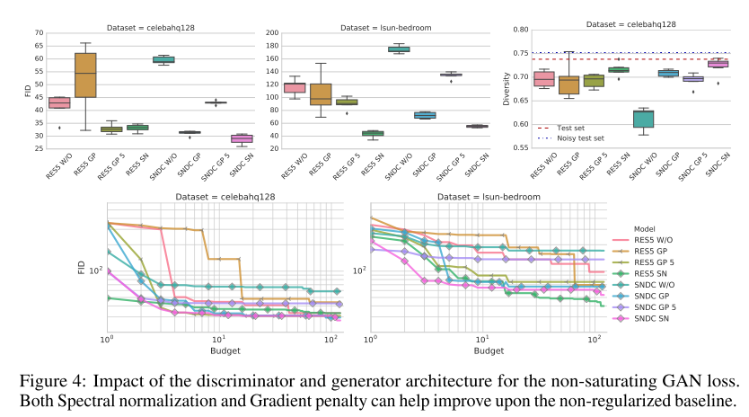

@title:  The GAN Landscape: Losses, Architectures, Regularization, and Normalization

@date:   2018-07-23

<!--
https://github.com/shunk031/paper-survey
-->

##  1. どんなもの？ 

実践的な視点からGANsの現状を分析した論文．  

GAN Landscapeを深く調査するだけでなく，現状のSOTAを再現した．

##  2. 先行研究と比べてどこがすごいの？ 

先行研究の調査論文.  

Loss, Regularization and Normalization, architecturesの3つ観点からGAN Landscapeを調査.  

落とし穴，再現性の問題，実践的な考慮事項を議論．

##  3. 技術や手法の"キモ"はどこにある？ 

###  3.1 Loss Functions 

- $Q$をモデル分布，$P$をターゲット分布とする

- Non-saturating loss[8]

  - $P$と$Q$間のJensen-Shannon divergenceを最小化することに等しい．
$$
{\cal L}_D=-\mathbb{E}_{x \sim P} [log(D(x))] - \mathbb{E}_{\hat{x} \sim Q} [log(1-D(\hat{x}))]
$$
$$
{\cal L}_G=- \mathbb{E}_{\hat{x} \sim Q} [log(D(\hat{x}))]
$$

- Wasserstein GAN(WGAN)[2]

  - $P$と$Q$間のWasserstein distanceを最小化する．

  - 最適なDiscriminatorのもとで証明されている最適輸送への接続を利用することで，Generatorに関する評価関数
  の最小化は，PとQ間のWasserstein距離の最小化である．

  - 欠点は，Kantorovich-Rubinstein 双対性を利用することによる1-Lipschitz Discriminatorを補償しなければならないこと．
$$
{\cal L}_D=-\mathbb{E}_{x \sim P} [D(x)] + \mathbb{E}_{\hat{x} \sim Q} [D(\hat{x})]
$$
$$
{\cal L}_G=- \mathbb{E}_{\hat{x} \sim Q} [D(\hat{x})]
$$

- Least squared loss[19]

  - $P$と$Q$間のPearson　$\chi^2$ divergenceを最小化することに対応．

  - 直観的に，この損失は滑らかで，JS定式化のsigmoid cross entropyよりゆっくりと飽和する．
$$
{\cal L}_D=-\mathbb{E}_{x \sim P} [(D(x)-1)^2] + \mathbb{E}_{\hat{x} \sim Q} [D(\hat{x})^2]
$$
$$
{\cal L}_G=- \mathbb{E}_{\hat{x} \sim Q} [(D(\hat{x})-1)^2]
$$

###  3.2 Regularization and Normalization of the Discriminator 

- Gradient norm penalty

  - 1-Lipschitznessに反して，簡単な制約として解釈できる(WGAN-GP)．代わりの最適結合として，勾配は訓練データと生成データ間の線形補間を評価する．

  - 欠点は，訓練中の変化するモデル分布$Q$に依存することである．

- Discriminator normalization

  - 最適化からの視点と表現力からの視点の両方から役にたつ．

  - 最適化の視点から

    - Batch normalization

      - レイヤーの活性化前のノードを平均 $\beta$ と標準偏差 $\gamma$ で正規化する．ここで $\beta$ と $\gamma$ は，各レイヤーの各ノードに関して学習されるパラメータ．正規化はバッチレベルで行われ，各ノードに関しては別々に行われる．

    - Layer normalization

      - レイヤー内の全ての隠れノードは，同じ正規化項 $\beta$ と $\gamma$ と共有する．しかし，異なるデータは，別々に正規化される．

  - 表現力からの視点から

    - NNを合成写像として考え，spectralの特性分析する．特に，Discriminatorに関して，線形演算子を有界にすることは，最大特異値を制御すればよい(Spectral normalization[20])．

    - 注意：この手法は，線形レイヤーとReLU活性化の1-Lipschitznessが保証する．しかし，畳み込みマップのカーネルのスペクトルノルムを1に制限することは，畳み込み写像のスペクトルノルムを1に制限することではない．実際，使用されるstrideとpaddingに依存する．

###  3.3 Generator and Discriminator Architecture 

- DCGANとResNetの構造を考える．これらの構造は，どこにでもいるため．128 $\times$ 128の画像で考える．

- **SNDCGAN**

- **ResNet**

\clearpage

###  3.4 Evaluation Metrics 

- Inception Score (IS)

  - 直観的に，意味のある物体を含むサンプルの条件付きラベル分布は低いエントロピーを持つべきである．また，サンプルの多様性はエントロピーが高くなければいけない．これらは，以下のようにあらわされる．

  $$
  IS = exp(\mathbb{E}_{x \sim Q}[d_{KL}(p(y | x), p(y))])
  $$

  - 欠点は，直観的にラベル全体の事前分布を含んでおり，適切な距離でないことである．

- Frechet Inception Distance (FID)

  - $P$ と $Q$ からのサンプルは最初に特徴空間(InceptionNetの特定の層)に埋め込む．埋め込まれたデータは，多変量ガウス分布に従うと仮定する．平均と共分散は推定され，2つガウス分布間のFrechet distanceが計算される．

  $$
  FID = ||\mu_x - \mu_y ||^2_2 + Tr(\Sigma_x + \Sigma_y -2(\Sigma_x\Sigma_y)^{\frac{1}{2}})
  $$

  - ここで， $(\mu_x, \Sigma_x)$ と $(\mu_y, \Sigma_y)$ は$P$ と $Q$ からの埋め込まれたサンプルの平均と共分散である．

  - FIDは，ISよりも，1クラスにつき1つの画像だけを生成するモデル（mode-collapse状態のモデル）は，完全なISを得ることができるが，悪いFIDとなる．

- Multi-scale Structural Similarity for Image Quality (MS-SSIM) and Diversity

  - GANsにおける最大の問題点は，mode-collapseとmode-droppingである．生成サンプルの多様性に関して，代わりとして，与えられたクラス内のペアごとのMS-SSIMスコアを使うことが提案されている．

  - 欠点として，クラスに対応する生成されたサンプルを知らないという点がある．だから，1つのクラスデータセットに一般的に適用される

\clearpage

##  4. どうやって有効だと検証した？ 

- CIFAR10, CELEBA-HQ-128, LSUN-BEDROOMのデータセットを使用

- DiscriminatorとGeneratorアーキテクチャによる違い

\clearpage

- Spectral normalizationとGradient penaltyの組み合わせ　結果

- DiscriminatorとGeneratorアーキテクチャによる違い

- デフォルトの選択として，non-saturating lossとspectral normalizationを使うべき．

- 追加の計算予算が与えられれば，gradient penaltyを追加し，収束するまでモデルを訓練することを提案

- わずかな追加の利益は，正規化と正則化を組み合わせることによって得られる．正規化と正則化は，Discriminatorのリプシッツ定数の重要性を経験的に確認しているものを使用する．

- ResNet styleアーキテクチャに適用された多くのトリックは，品質においてわずかな変化をもたらす．高い計算コストによって，避けるべきである．

\clearpage

##  5. 議論はあるか？ 

- Generatorにも，spectral normalizationのような表現能力に関する視点を持たせたほうがいいのか

- 一般的な問題として，メトリックの問題，データセットの前処理，非決定的，実装の詳細の欠如がある．

##  6. 次に読むべき論文はあるか？ 

  - WGAN-GP

    - Ishaan Gulrajani, Faruk Ahmed, Martin Arjovsky, Vincent Dumoulin, and Aaron Courville. Improved training of Wasserstein GANs. Advances in Neural Information Processing Systems (NIPS), 2017.

  - MS-SSIM

    - Zhou Wang, Eero P Simoncelli, and Alan C Bovik. Multiscale structural similarity for image quality assessment. In Asilomar Conference on Signals, Systems and Computers, 2003.

    - Augustus Odena, Christopher Olah, and Jonathon Shlens. Conditional image synthesis with auxiliary classifier GANs. In International Conference on Machine Learning (ICML), 2017.

    - William Fedus, Mihaela Rosca, Balaji Lakshminarayanan, Andrew M Dai, Shakir Mohamed, and Ian Goodfellow. Many paths to equilibrium: Gans do not need to decrease adivergence at every step. In International Conference on Learning Representations (ICLR), 2018.

  - Inception Score

    - Tim Salimans, Ian Goodfellow,Wojciech Zaremba, Vicki Cheung, Alec Radford, and Xi Chen. Improved techniques for training gans. In Advances in Neural Information Processing Systems (NIPS), 2016.

  - FID

    - Martin Heusel, Hubert Ramsauer, Thomas Unterthiner, Bernhard Nessler, Günter Klambauer, and Sepp Hochreiter. GANs trained by a two time-scale update rule converge to a Nash equilibrium. Advances in Neural Information Processing Systems (NIPS), 2017.

###  論文情報・リンク 

- Kurach, K., Lucic, M., Zhai, X., Michalski, M., & Gelly, S. (n.d.). The GAN Landscape: Losses, Architectures, Regularization, and Normalization.
