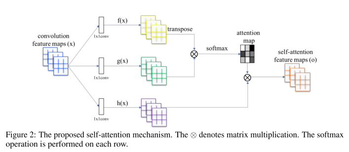
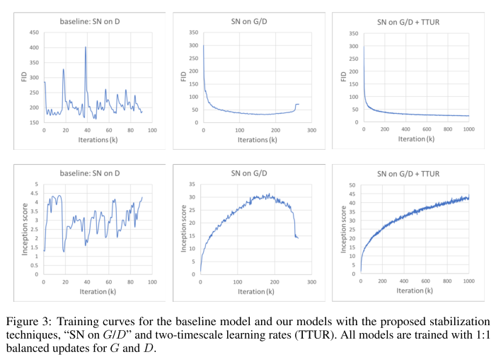
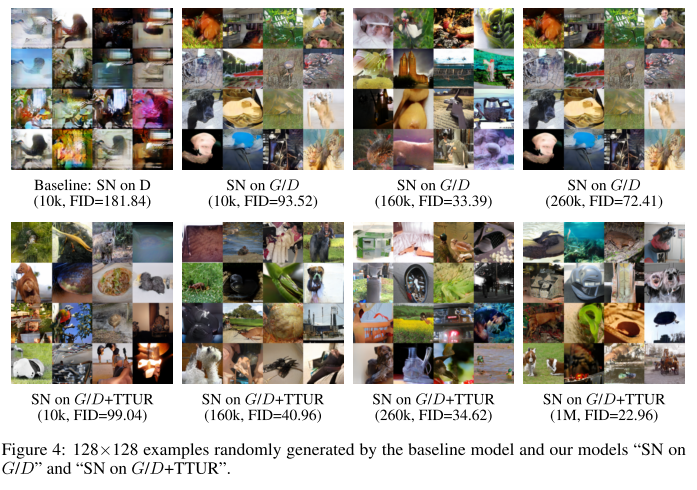
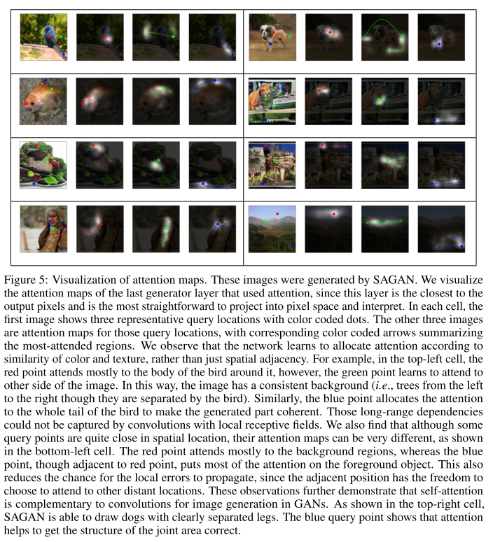

<!--
https://github.com/shunk031/paper-survey
-->

##  1. どんなもの？ 

Self-Attention Generative Adversarial Networkを提案．

Self-attentionを導入することにより，全ての特徴位置からの手がかりを使って，局所的な詳細を再現できるようになった．

GeneratorにもSpectral normalizationを導入することとTTURと呼ばれる学習テクニックについても言及している．

##  2. 先行研究と比べてどこがすごいの？ 

幾何学的特徴や構造パターンをとらえるのに今まで失敗してきた．これは異なる画像領域にわたる依存関係をモデル化するために，畳み込みに大きく依存しているからである．畳み込み層は局所受容野を持っているので，広範囲な依存関係はいくつかの畳み込み層を通したあとに扱われる．これは様々な理由で長距離依存性の学習を妨げる可能性がある．

**層を増やせば表現力は上がるが，計算効率や統計的有効性が失われる．そこでself-attentionを導入した．**

##  3. 技術や手法の"キモ"はどこにある？ 

- Self-Attention Generative Adversarial Networks

  前の隠れ層からの画像特徴 $x \in \mathbb{R}^{C \times N}$ は，atentionを計算するために，最初に2つの特徴空間 $\boldsymbol{f ,g}$ に変換する．ここで， 変換式は以下のようである．

  $$
  \boldsymbol{f}(\boldsymbol{x}) = \boldsymbol{W}_{\boldsymbol{f}}\boldsymbol{x}
  $$

  $$
  \boldsymbol{g}(\boldsymbol{x}) = \boldsymbol{W}_{\boldsymbol{g}}\boldsymbol{x}
  $$

  $$
  \beta_{j,i} = \frac{exp(s_{i,j})}{\sum_{i=1}^{N}exp(s_{i,j})} ~where~ s_{i,j} = \boldsymbol{f}(\boldsymbol{x_i})^T \boldsymbol{g}(\boldsymbol{x_j})
  $$

  $\beta_{j,i}$ はモデルがj番目の領域を合成したとき，i番目の位置にどれほど関与するかを表している．attention layerの出力は， $\boldsymbol{o = (o_1, o_2, ~...~, o_j, ~...~, o_N)} \in \mathbb{R}^{C \times N}$ である．

  $$
  \boldsymbol{o_j} = \sum_{i=1}^{N} \beta_{j,i}\boldsymbol{h(x_i)} ~where~ \boldsymbol{h(x_i)}=\boldsymbol{W_hx_i}
  $$

  上記の定式で，$\boldsymbol{W_g} \in \mathbb{R}^{\overline{C} \times C}$ ,$\boldsymbol{W_f} \in \mathbb{R}^{\overline{C} \times C}$ ,$\boldsymbol{W_h} \in \mathbb{R}^{C \times C}$ は学習される重み行列である．ここで，$1\times1$のconvolutionとして実装される．

  $\overline{C}=\frac{C}{8}$ を使用した．

  さらに，スケールパラメータによってattention 層の出力をかけ，入力特徴マップを組み入れる．

  $$
  \boldsymbol{y_i} = \gamma \boldsymbol{o_i} + \boldsymbol{x_i}
  $$

  $\gamma$ は0として初期化される．直観的に，最初に簡単なタスクを学習したく，そして徐々に複雑なタスクを学習させる．

  hingeロスを使って学習．

  $$
  \boldsymbol{L}_D=-\mathbb{E}_{(x,y) \sim p_{data}} [min(0, -1+D(x,y))] - \mathbb{E}_{z \sim p_z, y \sim p_{data}} [min(0, -1-D(G(z),y))]
  $$

  $$
  \boldsymbol{L}_G=-\mathbb{E}_{z \sim p_z, y \sim p_{data}} [D(G(z),y))]
  $$

  

- 学習テクニック

  - Spectral normalizationをGeneratorにも使う

    GeneratorにもSNを使うことで，良い結果を得られる．GANの性能において，Generatorの状態は重要な何気ない要因である．[18]

  - two-timescale update rule(TTUR)

    正則化Discriminatorでは学習が遅くなるという問題があるため，使ったほうがいい．具体的には，GeneratorとDiscriminatorに関して異なる学習率を使う．

##  4. どうやって有効だと検証した？ 

- 評価値

  - Inception Score

    - 欠点

      - 特定のクラスに所属するとして，自信をもって認識しているサンプルをモデルが生成することを保証することを本来意図している．また，モデルが多クラスからサンプルを生成することを保証することを本来意図している．クラス内の多様性もしくは，細かなリアリズムを必ずしも評価するわけではない．

  - Frechet Inception distance

- 実装詳細

  - 128 $\times$ 128

  - Adam ( $\beta_1=0$, $\beta_2=0.9$)

  - Discriminator($\alpha=0.0004$), Generator($\alpha=0.0001$)

- GeneratorとDiscriminatorの両方にSpectral normalizationを入れた方がよい．GeneratorとDiscriminatorの学習率を異なるものを使用した方がよい．更新回数は1:1を使う．

- 同じパラメータ数を持つResBlockと比較すると，self-attention Blockはよりよい結果を得た．このことから，SAGANによる性能向上は，モデルの深さ，容量の単純な増加によるものではない．

- 生成過程で何を学習されたかを理解するために，異なる画像のGeneratorのattention重みを可視化

##  5. 議論はあるか？ 

- attention の可視化はどうやっているのだろう．

- 3次元の場合は？

##  6. 次に読むべき論文はあるか？ 

- Self-attention

  - J. Cheng, L. Dong, and M. Lapata. Long short-term memory-networks for machine reading. In EMNLP, 2016.

  - A. P. Parikh, O. Täckström, D. Das, and J. Uszkoreit. A decomposable attention model for natural language inference. In EMNLP, 2016.

  - A. Vaswani, N. Shazeer, N. Parmar, J. Uszkoreit, L. Jones, A. N. Gomez, L. Kaiser, and I. Polosukhin. Attention is all you need. arXiv:1706.03762, 2017.

- hinge loss

  - J. H. Lim and J. C. Ye. Geometric gan. arXiv:1705.02894, 2017.

  - T. Miyato, T. Kataoka, M. Koyama, and Y. Yoshida. Spectral normalization for generative adversarial networks. In ICLR, 2018.

  - D. Tran, R. Ranganath, and D. M. Blei. Deep and hierarchical implicit models. arXiv:1702.08896, 2017.

- Spectral normalizationをGeneratorに組み込むevidence

  - A. Odena, J. Buckman, C. Olsson, T. B. Brown, C. Olah, C. Raffel, and I. Goodfellow. Is generator conditioning causally related to gan performance? In ICML, 2018.

- two timescale update rule

  - M. Heusel, H. Ramsauer, T. Unterthiner, B. Nessler, and S. Hochreiter. Gans trained by a two time-scale update rule converge to a local nash equilibrium. In NIPS, pages 6629–6640, 2017.

  - IS

    - T. Salimans, I. J. Goodfellow,W. Zaremba, V. Cheung, A. Radford, and X. Chen. Improved techniques for training gans. In NIPS, 2016.

- FID

  - M. Heusel, H. Ramsauer, T. Unterthiner, B. Nessler, and S. Hochreiter. Gans trained by a two time-scale update rule converge to a local nash equilibrium. In NIPS, pages 6629–6640, 2017.

###  論文情報・リンク 

- Zhang, H., Goodfellow, I., Brain, G., Metaxas, D., & Odena, A. (2018). Self-Attention Generative Adversarial Networks.
