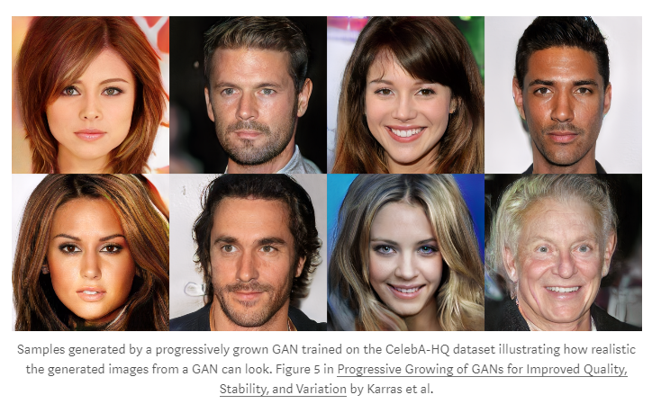
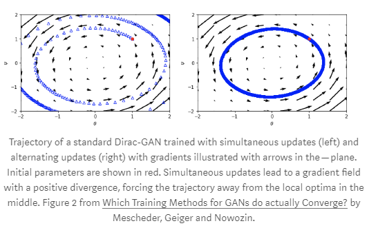
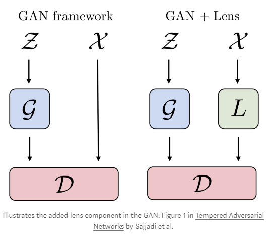
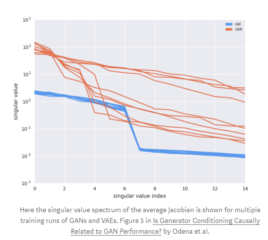

---
title:  "Generative Adversarial Nets and Variational Autoencoders at ICML 2018"  
date:   2018-08-13
---

##  1. どんなもの？ 

- 著者が面白いと感じたトピックをシェアする．
- 生成モデルは，古典的にデータ $x$ とラベル $y$ を持つ同時分布 $p(x,y)$ のモデルを記述する．
- しかし，ここでは生成モデルを新しいサンプル $x \sim X$ を提供するために，近似データ分布 $X$ からサンプリングするメカニズムを要するものを意味すると解釈する．
- 生成モデルの一般的なものは，GANsとVAEである
  - Ian Goodfellow’s [GAN tutorial from NIPS 2016](https://arxiv.org/abs/1701.00160)
  - Irhum Shafkat’s [Intuitively Understanding Variational Autoencoders](https://towardsdatascience.com/intuitively-understanding-variational-autoencoders-1bfe67eb5daf)
- GANsは，学習の不安定さの問題があり，mode collapseに苦しむ．しかし，理想的な状態では，とても現実的な画像を生成できる．

- 一方，VAEでは訓練することは簡単だが，尤度最大化によってよりぼけた画像を生成する傾向がある．
- 高い表現力を持つdecoderを使ったとき，VAEはときどき潜在ベクトルを無視する傾向があり，posterior collapseとして知られるものにつながる．

###  生成モデルの理解 

#### GANs

[Which Training Methods for GANs do actually Converge?](http://proceedings.mlr.press/v80/mescheder18a.html)
- この論文は，2つだけのパラメータを持つ単純化されたGANsを組み立てることによって始まる．
  - Generatorを構成するDirac分布の中心を制御するパラメータ
  - 線形分類器Discriminatorの勾配を制御するパラメータ
  - 名づけてDirac-GAN
- 同時更新（勾配を計算し，DiscriminatorとGeneratorの重みを同時に更新する）は，非安定な訓練になる傾向がある．

- GANの訓練軌跡，勾配のベクトル場を表している．

- 勾配ベクトル場は高い回転成分を持つようである．また，多くの手法は限りある円に突き当たる傾向がある．
- 定留点から解を強制的に移動させる可能性があるので，optimizerにmomentumを使うべきでないという著者の推奨の理由である．

- よくまとまっている

[Toward Theoretical Understanding of Deep Learning tutorial](http://unsupervised.cs.princeton.edu/deeplearningtutorial.html)

#### VAEs
[Fixing a Broken ELBO](http://proceedings.mlr.press/v80/alemi18a.html)

- evidence lower bound(ELBO) loss項を調査する
- ELBOの導出の古典的な手法を取る代わりに，データ $X$と潜在コード $Z$間の相互情報量 $I(X;Z)$ を研究することによって始まる．
- 以前から知られていた相互情報量の境界に基づいて，境界を述べる
$$
H-D\leq I(X;Z) \leq R
$$
- $H$はデータのエントロピー，$D$はエンコーダを通した歪みの尺度，$R$は比率
- 潜在コードをエンコードするのに必要な追加情報の尺度は，$Z$上の最適なコードと比較されるエンコーダからサンプルする．
- ゼロ分布$D$は，潜在コードにおいて情報が失われないことを意味しており，サンプルは正確に再現できる．しかし，潜在コードが実際に役に立つものを獲得しているかは意味していない．一方，ゼロ比率$R$は$Z$に$X$の独立を課す

### Novel methods

#### 1
[Tempered Adversarial Networks](http://proceedings.mlr.press/v80/sajjadi18a.html)
- 重複していないサポートの問題に取り組んだ

[non-overlapping support](http://proceedings.mlr.press/v70/arjovsky17a.html)

#### 2
[Mixed batches and symmetric discriminators for GAN training](http://proceedings.mlr.press/v80/lucas18a.html)
- [Minibatch discrimination](https://arxiv.org/abs/1606.03498)の亜種を提案

### Measuring and comparing quality of generated data

- 今までは，Inception ScoreやFIDを使って評価されてきた．一般的なAdversarial attacksによってもてあそばれる．また，いつも知覚的評価とよく相関があるわけではない

#### 1

[Geometry Score: A Method For Comparing Generative Adversarial Networks](http://proceedings.mlr.press/v80/khrulkov18a.html)

- topological data analysis(TDA)を使って，生成データと実データのトポロジーを比較する．

#### 2

[Is Generator Conditioning Causally Related to GAN Performance?](http://proceedings.mlr.press/v80/odena18a.html)

- Jacobian singular valuesを制御することの重要性を示した以前の研究を拡張した．
- condition number(最大特異値と最小特異値間の比率)に注目している
- 低いほどより安定
- 理論が不安定さにリンクすることによって部分的に動機付けられている．

1. 実行のおよそ半分は，低いCNを獲得し，のこりの半分は高いCNを獲得している．同じクラスタ内の値はかなり近づいている．したがって，良い，悪いの実行を特定することができる．

2. GANsとVAE decodersの平均Jacobianの両方の特異値スペクトラムを研究した．VAEは特異値の小さな分散を持つ．VAEは低いCNを持つ傾向がある．これは，訓練の安定性を反映する定量的であるためおもしろい．

- CNを減らすために，特異値のレンジを制御するJacobian clampingという手法を提案している．

###  結論 

##  2. 先行研究と比べてどこがすごいの？ 

##  3. 技術や手法の"キモ"はどこにある？ 

##  4. どうやって有効だと検証した？ 

##  5. 議論はあるか？ 

##  6. 次に読むべき論文はあるか？ 

###  論文情報・リンク 

- [Generative Adversarial Nets and Variational Autoencoders at ICML 2018](https://medium.com/peltarion/generative-adversarial-nets-and-variational-autoencoders-at-icml-2018-6878416ebf22)
