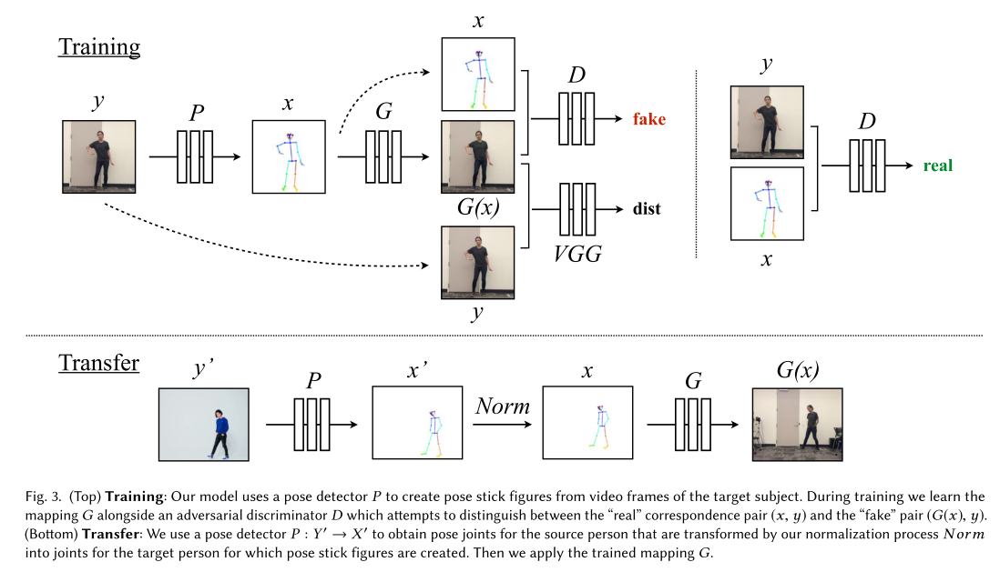
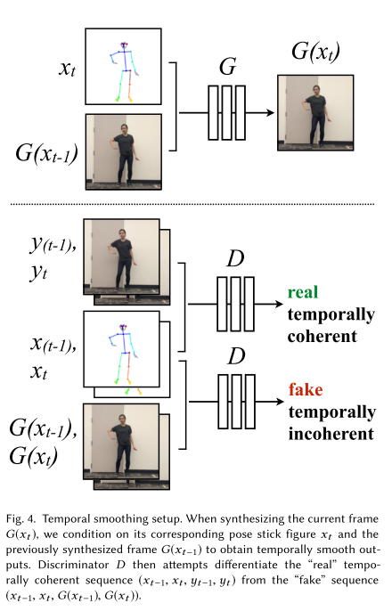
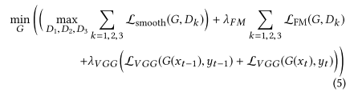
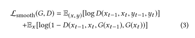
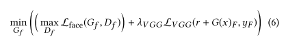
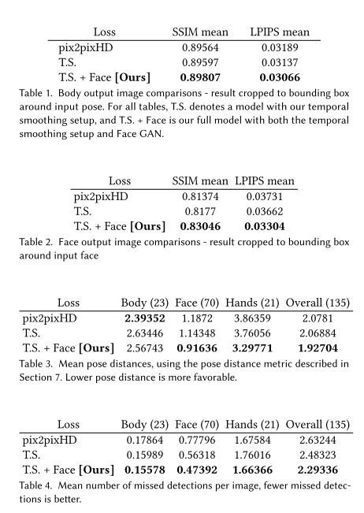
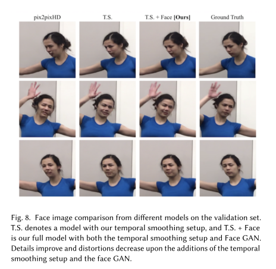

---
title:  "Everybody Dance Now"  
date:   2018-08-28
---

##  1. どんなもの？ 

- モーション変換の手法を提案．

- 踊っている人のビデオ(source video)があれば，標準的な動きをしているターゲットにその動きを転送することができる．

- 時空間の滑らかさを用いてフレームごとの画像から画像への変換としてこの問題を扱う．

##  2. 先行研究と比べてどこがすごいの？ 

- ビデオ間の人のモーション変換に関する学習ベースのパイプラインを提案したこと

- 現実的で詳細なビデオにおいて，複雑なモーション変換できるという結果

##  3. 技術や手法の"キモ"はどこにある？ 

- ゴールは，ソースと同じ動きをするターゲットの新しいビデオを生成すること．

- 3つのステージからなる．

  - pose detection

    - pretrainingされたSOTAのpose detectorを使って，pose stick figuresを作成

  - global pose normalization

    - ソースとターゲットの体の形と位置間の違いを説明する．

    - 高さと足首の位置を分析することによって，この変換を探す．

  - mapping from normalized pose stick figures to the subject

    - adversarial trainingを用いて，normalized pose stick figuresからターゲットの画像への変換（写像）を学習する．

    - 独立したフレームを生成する代わりに，２つの連続フレームを生成する．

    - 一つは，$G_{x_{t-1}}$ ．これは，対応するpose stick figure $x_{t-1}$ とゼロ画像に条件付けられている．

    - 2つ目の出力は，$G_{x_{t}}$ は対応するpose stick figure $x_t$ と最初の出力$G_{x_{t-1}}$に条件つけられている．

    - Discriminatorは，fake sequence $(x_{t-1}, x_t, G_{x_{t-1}}, G_{x_{t}})$ とreal sequence $(x_{t-1}, x_t, y_{t-1}, y_t)$ 間の現実と時間一貫性の違い両方の差を決定することを任されている．

      

    - 最初にメインGeneratorとDiscriminatorを訓練する．

      

      

    - generatorとdiscriminatorの重みは固定し，face GANの訓練を行う．

      

##  4. どうやって有効だと検証した？ 

- ablation study

  - temporal smoothingとface GANをいれたとき

- 評価値

  - SSIM

  - Learned Perceptual Image Patch Similarity(LPIPS)

  - キーポイントの平均の距離

- 結果

  

  

##  5. 議論はあるか？ 

- 計算コストが高そう．

- 顔の構造を学習させた方が，いい形状になっている

##  6. 次に読むべき論文はあるか？ 

- Pose detector[5, 27, 35]

  - Zhe Cao, Tomas Simon, Shih-EnWei, and Yaser Sheikh. 2017. Realtime Multi-Person 2D Pose Estimation using Part Affinity Fields. In CVPR.

  - German KM Cheung, Simon Baker, Jessica Hodgins, and Takeo Kanade. 2004. Markerless human motion transfer. In 3D Data Processing, Visualization and Transmission, 2004. 3DPVT 2004. Proceedings. 2nd International Symposium on. IEEE, 373–378.

  - Shih-EnWei, Varun Ramakrishna, Takeo Kanade, and Yaser Sheikh. 2016. Convolutional pose machines. In CVPR.

- pix2pix

  - Ting-ChunWang, Ming-Yu Liu, Jun-Yan Zhu, Andrew Tao, Jan Kautz, and Bryan Catanzaro. 2017. High-Resolution Image Synthesis and Semantic Manipulation with Conditional GANs. arXiv preprint arXiv:1711.11585 (2017).

- OpenPose

  - ネットワークアーキテクチャ

  - Zhe Cao, Tomas Simon, Shih-EnWei, and Yaser Sheikh. 2017. Realtime Multi- Person 2D Pose Estimation using Part Affinity Fields. In CVPR.

  - Tomas Simon, Hanbyul Joo, Iain Matthews, and Yaser Sheikh. 2017. HandKeypoint Detection in Single Images using Multiview Bootstrapping. In CVPR

  - Shih-EnWei, Varun Ramakrishna, Takeo Kanade, and Yaser Sheikh. 2016. Convo- lutional pose machines. In CVPR.

- Learned Perceptual Image Patch Similarity

  - Richard Zhang, Phillip Isola, Alexei A Efros, Eli Shechtman, and OliverWang. 2018. The Unreasonable Effectiveness of Deep Features as a Perceptual Metric. In CVPR.

###  論文情報・リンク 

- [Chan, C., Berkeley, U. C., Ginosar, S., Zhou, B. T., & Efros, A. A. (2018). Everybody Dance Now,](https://arxiv.org/pdf/1808.07371.pdf)
