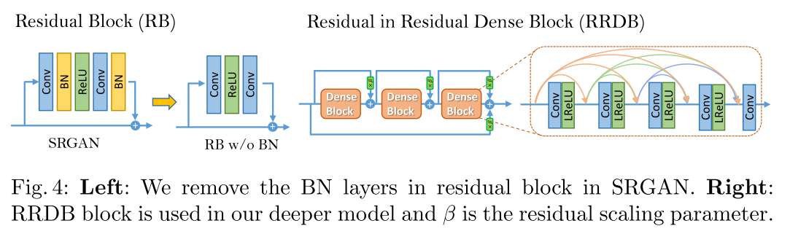
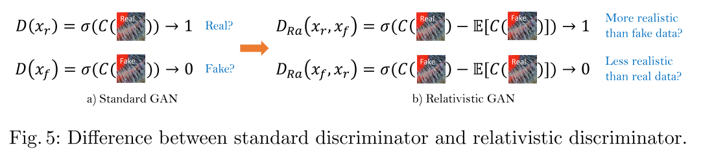
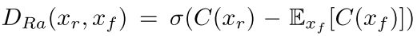
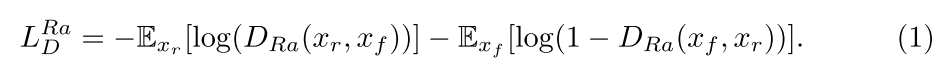
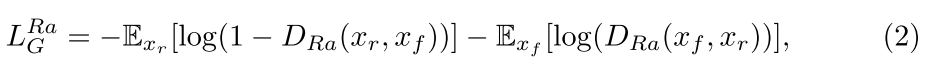
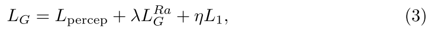
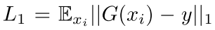
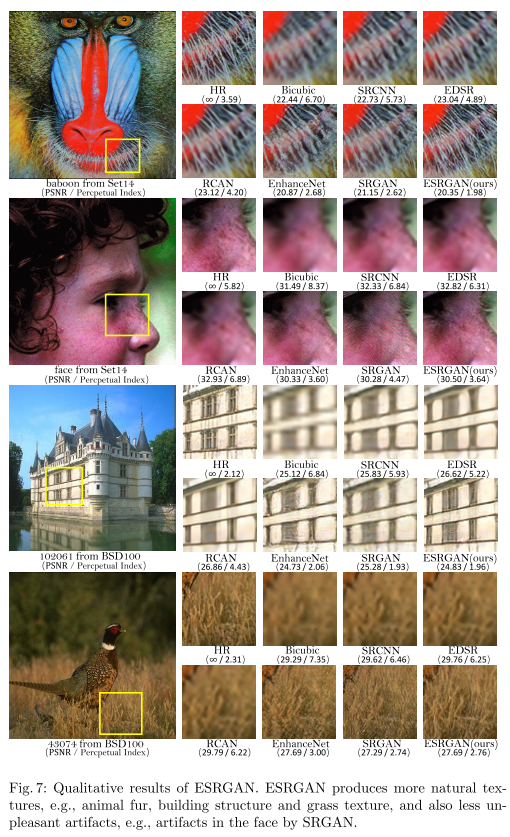

##  1. どんなもの？ 

- PISR2018-SR Challenge(Region3)の1位の手法

- SRGANをネットワーク構造，adversarial loss，perceptual lossの３つ観点から改造

##  2. 先行研究と比べてどこがすごいの？ 

- PISR2018-SR Challengeのperceptual indexの評価値において，1位の手法

##  3. 技術や手法の"キモ"はどこにある？ 

- ネットワーク構造

  - 不自然な模様を生成することがあるため，BNを取り外す

  - Residual Blockを Residual-in-Residual Dense Block(RRDB)に置き換える

  

  - BNを外すことで計算コストを下げ，性能を向上させるが，ネットワークの規模を大きくする必要がある？

  - $\beta$ というresidual scaling パラメータを導入

  - 初期パラメータの分散をより小さくなるようにしたとき，訓練しやすくなる

- Relativitic Discriminator(相対的Discriminator)

  - 「その画像が本物か偽物かどうか」ではなく，「その画像が他のものより写実的であるかどうか」を判定

  

  - $\sigma$ はシグモイド関数，$C(x)$ は変換されていないDiscriminatorの出力

  - Discriminator loss

    

     

  - Generator loss

    

    - Perceptual lossまで含めると

    

    

    - $y$ : ground truth, $G(x_i)$ : 復元画像

- Perceptual loss

  - 活性化前を用いた方がよい

##  4. どうやって有効だと検証した？ 

- 使用データセット

  - DIV2K dataset

    - Agustsson, E., Timofte, R.: Ntire 2017 challenge on single image super-resolution: Dataset and study. In: CVPRW. (2017)

  - Flickr2K dataset

    - Timofte, R., Agustsson, E., Van Gool, L., Yang, M.H., Zhang, L., Lim, B., Son, S., Kim, H., Nah, S., Lee, K.M., et al.: Ntire 2017 challenge on single image super-resolution: Methods and results. In: CVPRW. (2017)

- 学習設定

  - パッチサイズ： 128*128

  - L1でpretraining, lr = 1*10^-4

    - lr decayを使ってるわ，これ

  - random horizontal flip, 90 degree rotations

- 結果画像

    

##  5. 議論はあるか？ 

- L1を使うか迷う

- 今やってるやつパッチサイズ小さいんじゃね？？

##  6. 次に読むべき論文はあるか？ 

- 評価値

  - Ma’s score

    - Ma, C., Yang, C.Y., Yang, X., Yang, M.H.: Learning a no-reference quality metric for single-image super-resolution. CVIU 158 (2017) 1–16

  - NIQE

    - Mittal, A., Soundararajan, R., Bovik, A.C.: Making a completely blind image quality analyzer. IEEE Signal Process. Lett. 20(3) (2013) 209–212

  - perceptual-quality aware manner

    - Blau, Y., Michaeli, T.: The perception-distortion tradeoff. In: CVPR. (2017)

- semantic image priorを導入したやつ

  - Wang, X., Yu, K., Dong, C., Loy, C.C.: Recovering realistic texture in image super-resolution by deep spatial feature transform. In: CVPR. (2018)

- Relativistic GAN

  - Jolicoeur-Martineau, A.: The relativistic discriminator: a key element missing from standard gan. arXiv preprint arXiv:1807.00734 (2018)

- back projection

  - PSNRとperceptual indexを上げるために，後処理として使用

  - Timofte, R., Rothe, R., Van Gool, L.: Seven ways to improve example-based single image super resolution. In: CVPR. (2016)

###  論文情報・リンク 

- [Dong, C., Loy, C. C., Qiao, Y., & Tang, X. (n.d.). ESRGAN : Enhanced Super-Resolution.](https://arxiv.org/abs/1809.00219)
