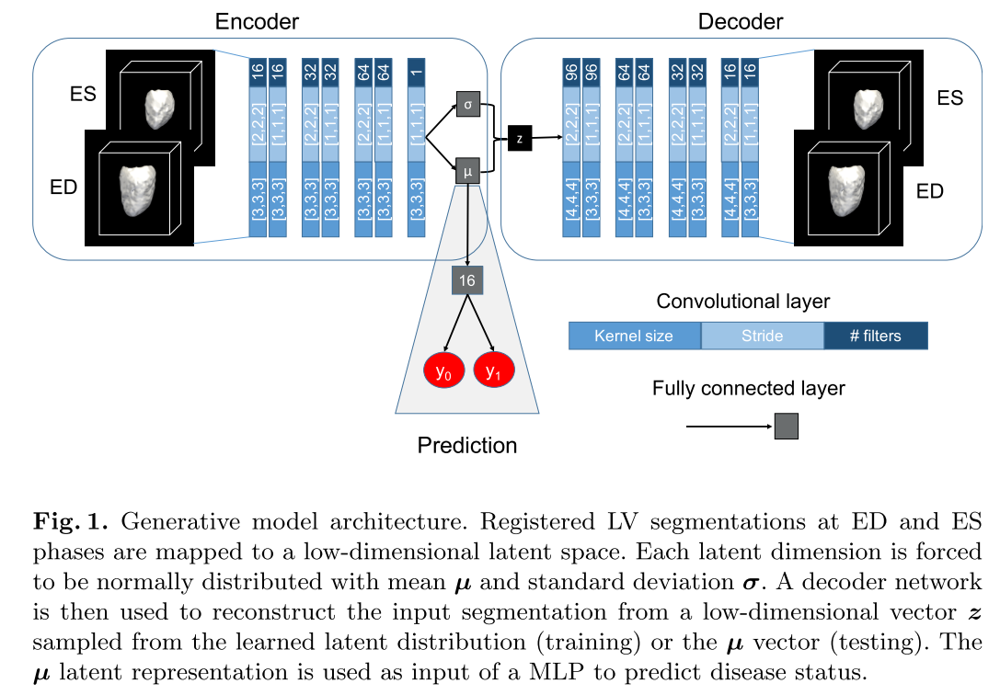
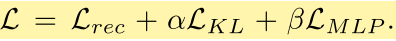
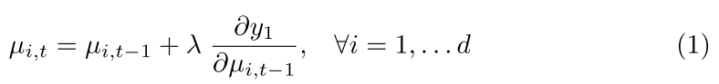
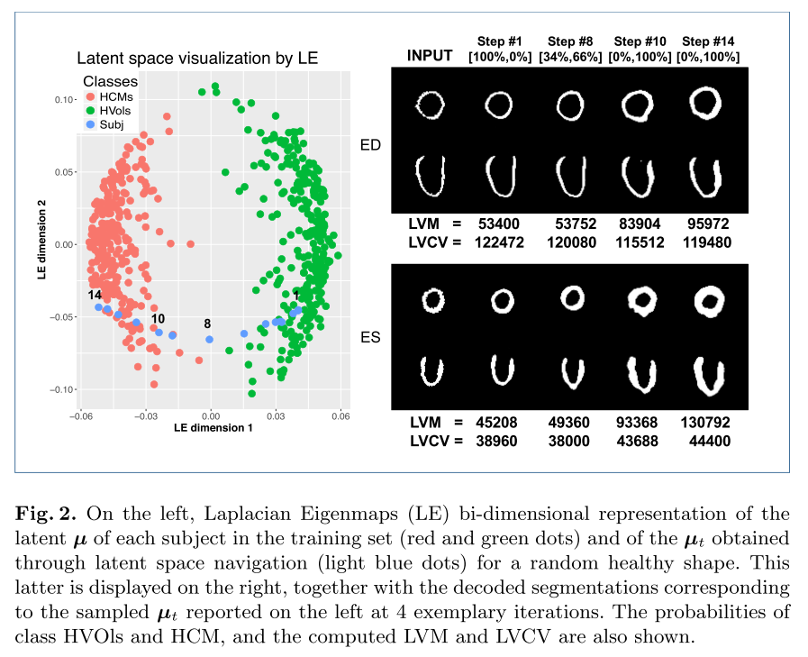

---
title:  "Learning Interpretable Anatomical Features Through Deep Generative Models: Application to Cardiac Remodeling"  
date:   2018-10-05
---

##  1. どんなもの？ 

- 特徴抽出と決定プロセスにおける解釈性不足は，臨床診断ではDNNなどの能力を制限する．

- 画像の自動分類のための3D convolutional generative model を提案

- 画像は，構造変形と関連がある心臓病を持つ患者から取得されたものを使用

- モデルは3Dセグメンテーションから学習された，解釈可能でタスク固有の解剖パターンを活用する

##  2. 先行研究と比べてどこがすごいの？ 

- 解釈できる点

##  3. 技術や手法の"キモ"はどこにある？ 

- ネットワーク構造

  

- 3D Convolutional VAEは，エンコーダネットワークを通して，潜在空間での入力セグメンテーションXを表現するd次元確率分布を学習

- 潜在空間は，d次元正規分布Nによって，パラメータ化する

- 訓練中，decoderは，入力セグメンテーションXの近似を再構成することを学習する

  - として表記

  - 学習された潜在d次元多様体Zからベクトルzをサンプリングすることによって，再構成

- prediction networkはMLPで実行される．

  - 平均ベクトルμと結合されており，HVolsとHCMs subjectを識別するように訓練

- 損失関数

  

  - 第1項：再構成誤差（入力セグメンテーションXと再構成間のSorense-Dice loss）

  - 第2項：Kullback-Leibler divergence loss 事前分布できるだけ近づけようとする

  - 第3項：cross-entropy

- テスト時

  - 各入力セグメンテーションは予測されたμからzに通すことによって再構成される

    - zは潜在空間からサンプリングしない

  - 一方，訓練時に分類される

- 潜在空間でのナビゲーションを通して学習された特徴を解釈

  - 生成モデル構造は，原セグメンテーション空間での学習された特徴の可視化を許す

  - MLPによって学習された重みは，病変クラスC(yc)を潜在空間表現μに関しての偏微分を計算することに利用可

  - すなわち，クラスラベルCからμiへの勾配を，バックプロパすることによって

  - ランダムに選ばれた健康的な形状を与えると，反復アルゴリズムを使って，クラスCへの分類確率を最大にする潜在コードの方向に沿って対象μの潜在表現を移動できる

  - 健康形状の平均潜在表現からスタートして，以下の式によって，反復的に平均を更新

    

  - 最終的に，各潜在表現μiはデコーダによってセグメンテーション空間に戻される

  - だから，どのような形状かわかる

##  4. どうやって有効だと検証した？ 

- Datasets

  - 686HCMsの患者からなる複数のセンターから取得

- On the left of Fig. 2, the latent 64-dimensional representation µ of the training set segmentations together with the latent representations µt obtained at each iter- ation t were reduced for visualization purposes to a bi-dimensional space using Laplacian Eigenmaps [19].

##  5. 議論はあるか？ 

- future plan

  - 異なるセンターからの巨大な見ていないデータセットにおいて提案手法を評価，また，様々なタイプの心筋症でも評価

  - 医用画像領域に関する解釈可能なDL分類器の開発の方へのステップを約束

##  6. 次に読むべき論文はあるか？ 

###  論文情報・リンク 

- [Biffi, C., Oktay, O., Tarroni, G., Bai, W., De Marvao, A., Doumou, G., … Rueckert, D. (2018). Learning Interpretable Anatomical Features Through Deep Generative Models: Application to Cardiac Remodeling, 1–8. https://doi.org/10.1007/978-3-030-00934-2_52](https://arxiv.org/pdf/1807.06843.pdf)
