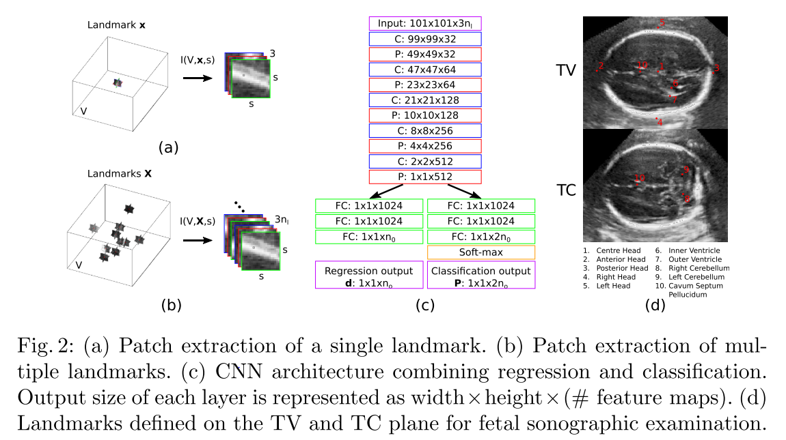
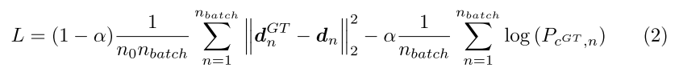

---

title:  "Fast Multiple Landmark Localisation Using a Patch-based Iterative Network"  

date:   2018-10-10

---

##  1. どんなもの？ 

- 3D医療画像における，高速で正確なランドマーク位置推定のためのPatch-based Iterative Network (PIN)を提案

- 推論中は，真のランドマーク位置に収束するまで，パッチは，繰り返しCNNに通される

- 推論中は，少ない数パッチが選択的にサンプルされるので，PINは計算的に効率的である．

  - ボリューム内の各位置における深いサンプルよりも反復的手法を用いている

- 回帰と分類の組み合わせるmulti-task learning frameworkを適用する．

- PCAを使うことによって複数ランドマークを特定するために，PINを拡張する

- ランドマーク間の大局的な解剖的関係をモデル化する．

- 72枚の3D超音波画像 (胎児の脳)を使って評価

##  2. 先行研究と比べてどこがすごいの？ 

- 速度が速い場所？？

##  3. 技術や手法の"キモ"はどこにある？ 

- 全体像

    

    - 目的：ランドマーク座標の予測 (赤：正解，緑：入力パッチ)

    - 前の位置xtから新しい位置xt+1を計算する

    - パッチを入力して，真のランドマーク位置につくまで反復される

- ネットワークへの入力

  - 2.5D表現を使用

  - xを中心として2次元画像パッチを各軸方向から抽出

    - patch extraction function I(V, x, s)

    - s: 矩形パッチの長さ

    

  - 入力する際は，3つの2次元パッチを3-ch 2Dパッチとしてconcatされる

- joint regression and classification

    - 回帰と分類タスクを組み合わせることによって，PINは同時に現在位置の動き方向と動き量を予測する

    - 回帰

      - 現在の位置からどのくらい動くべきかを推定する

      - 出力：d = (d1, d2, ..., dn0)^T

      - 単一ランドマーク位置推定において，dはn0=3を持っている（各軸）

    - 分類

      - 6方向の離散分類に分割することによって，真のランドマーク方向への現在位置動きの方向を推定する

      - cはクラスラベルとして示す

        

      - c1^+：正のｘ軸の方向に沿って移動することを表現

      - 分類出力Pは，確率に直される

        

      - ボリュームVとGround truth landmark point x^GTが与えられると，訓練サンプルはとして表現される

      - xはVからランダムにサンプルされる

      - ground truth displacement vectorはとして与えられる．

      - P^GTを得るために，最初にGT classification label c^GTを決定する．

      - 最大絶対値を使って，d^GTの要素を選択することによって，

        

        

      - ベクトルaに関して，argmax(a)は最大値を持つベクトル要素のインデックスを返す

      - 訓練中，hard labelが使われる．

    - 損失関数

        

      - 第１項：回帰のユークリッド距離

      - 第２項：分類のcross-entropy

      - dnとPcGT,nは，回帰と分類の出力

- PIN Inference

  - 画像が与えられると19点で初期化される（1点は画像中心，他の18は，画像サイズの1/4の固定された距離）

  - T iterations繰り返される．

  - iteration Tにおける19点の最終位置は，平均化され，最終ランドマーク予測をしめす

  - 複数の初期化は，エラーを平均化し，精度を向上させる

- PIN update rules

  - Rule A

    - クラス分類出力Pにのみ基づく

    - 予測Pでの高確率をもつ方向カテゴリに，1ピクセル動かすことによって現在位置を更新

  - Rule B

    - 回帰出力dにのみに基づく

    - xt+1 = xt + dによって与えられる

  - Rule C

    - 回帰と分類の両方を利用

    - xt+1 = xt + <Pmax, d>によって計算

    - <>は，要素ごとの掛け算

- Multiple Landmarks localisation

  - 削減された次元空間で動かすことによって，ランドマーク間の関係を説明するCNNモデルを使う

  - 1つの画像のnl個のランドマーク

    

  - Xの訓練セットが与えられると，PCAを使う．

  - Xをより低い次元空間に変換するために

  - オリジナルと削減空間間の変換は以下のように与えられる

  

  - X~：学習セットの平均

  - bがnb要素ベクトル

  - ここで，nb < 3nlかつ行列Wの列は，nb個の固有ベクトル

##  4. どうやって有効だと検証した？ 

- Data

  - 72枚の胎児頭部の3D 超音波 ボリュームで評価

  - 10個のランドマーク

- Our proposed PIN approach also outperforms a recent state-of-the-art landmark localisation approach using DRL [2].

- Since PIN-Multiple accounts for anatomical relationships among the landmarks, it has a lower overall localisation error than PIN-Single.

  

  

##  5. 議論はあるか？ 

- 損失の線形補間の感じいいかな

##  6. 次に読むべき論文はあるか？ 

- DRL

  - Ghesu, F.C., Georgescu, B., Mansi, T., Neumann, D., Hornegger, J., Comaniciu, D.: An artificial agent for anatomical landmark detection in medical images. In: MICCAI 2016. pp. 229–237 (2016)

###  論文情報・リンク 

- [Li, Y., Alansary, A., Cerrolaza, J. J., Khanal, B., Sinclair, M., Matthew, J., … Rueckert, D. (2018). Fast Multiple Landmark Localisation Using a Patch-based Iterative Network, (c). Retrieved from http://arxiv.org/abs/1806.06987](https://arxiv.org/pdf/1806.06987.pdf)
